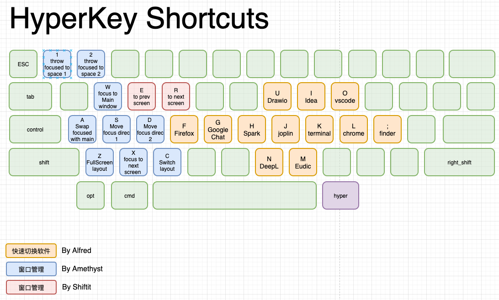

# HyperKey rules the **Window management** && **Software switch**

用 HyperKey 无鼠标并且飞快地切换软件以及管理窗口

# Video

- [视频讲解|正在做]()
- Timeline
	- 效果演示
	- 简介（涉及软件及其他平台） KeyBoard 一览
	- Amethyst && Shiftit 窗口管理
	- Alfred 软件切换
## 思路
左边管理窗口，右边切换软件

- 示意图
	- [源文件](./hyperkey-shortcuts.drawio)
	- 

## 窗口管理 ｜ Amethyst

Mac上没有炫酷的 `dwm`，我使用 [Amethyst](`https://github.com/ianyh/Amethyst`) 进行窗口管理(外加 [shiftit](https://github.com/fikovnik/ShiftIt) 辅助)

## 软件切换 | Alfred workflow

`Alfred workflow` 是要钱的, 但是确实挺好用的。
因为公司报销...所以我就直接用了这个，大家如果有其他免费的好用的，可以分享一下，给我提个 PR.