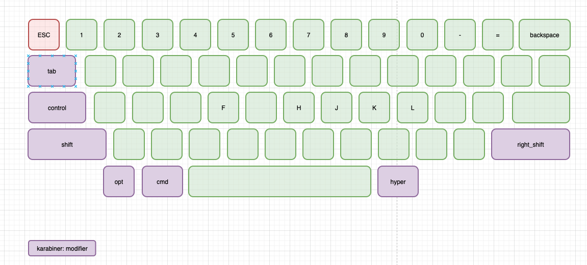
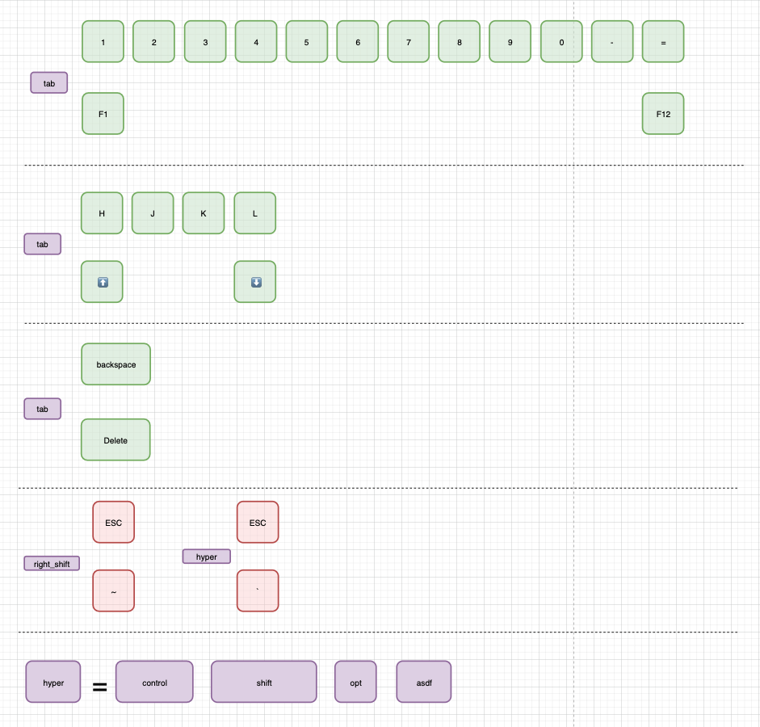

# 配置说明
1. 把这个 `json` 文件放在 '$HOME/.config/karabiner/assets/complex_modifications' 目录下
2. 打开 karabiner 软件， 点击 `complex modifications` 标签页，点击 `add rule`，这时弹出的 Popup 就有那些 Json 设置的改键，enable一下就可以了

# 视频参考

- [改键思路](https://www.bilibili.com/video/BV12g411N7hv/)
- 改键示意图
	- [源文件](./Keyboard改键示意图.drawio)
	- 
	- 

