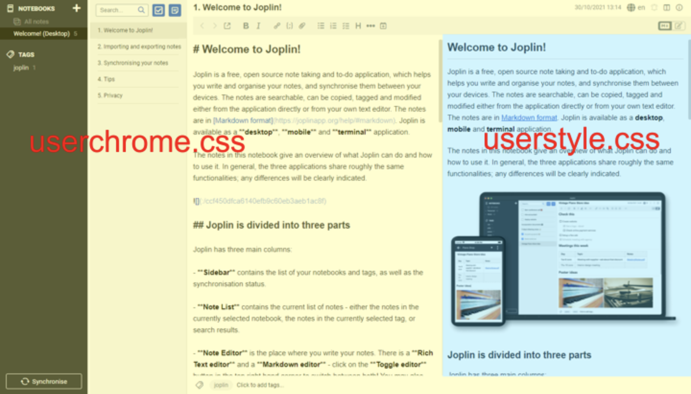

# 简介
- 复制这两个 `css` 文件放到 `$HOME/.config/joplin-desktop/` 目录下, 然后重启 Joplin 软件,对样式的修改就会生效了
- 可以理解为 
    - `userchrome.css` 控制的是 Markdown 的样式
    - `userstyle.css` 控制的是 渲染后 的样式
    - 

# 样式收集

文件夹下包括 `userchrome.css`,`userstyle.css`以及示例图